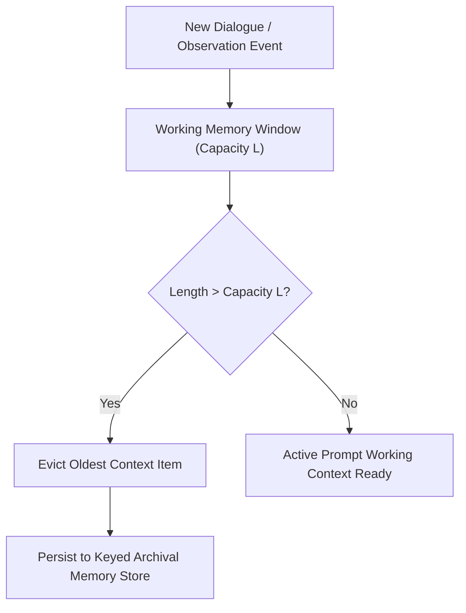

# genpark-hierarchical-tiered-memory-manager-skill

Agent Skill implementing **MemGPT-Inspired Hierarchical Tiered Memory & Context Paging** in 100% Python standard library.

## Architectural Flow

